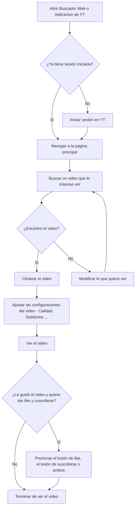
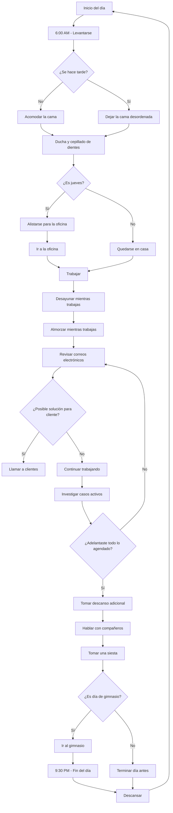

```mermaid

flowchart TD
    A[Abrir Buscador Web o Aplicacion de YT] --> B{¿Ya tiene sesión iniciada?}
    B -->|Si| C[Navegar a la pagina principal]
    B -->|No| D[Iniciar sesión en YT]
    D --> C
    C --> E[Buscar un video que le interese ver]
    E --> F{¿Encontro el video?}
    F -->|Si| G[Clickear el video]
    F -->|No| H[Modificar lo que quiere ver]
    H --> E
    G --> I[Ajustar las configuraciones del video - Calidad, Subtitulos ...]
    I --> J[Ver el video]
    J --> K{¿Le gustó el video y quiere dar like y suscribirse?}
    K -->|Si| L[Precionar el botón de like, el botón de suscribirse o ambos]
    K -->|No| M[Terminar de ver el video]
    L --> M

```

```mermaid
flowchart TD
    A["Inicio del día"] --> B["6:00 AM - Levantarse"]
    B --> C{"¿Se hace tarde?"}
    C -- No --> D["Acomodar la cama"]
    C -- Sí --> E["Dejar la cama desordenada"]
    D --> F["Ducha y cepillado de dientes"]
    E --> F
    F --> G{"¿Es jueves?"}
    G -- Sí --> H["Alistarse para la oficina"]
    H --> I["Ir a la oficina"]
    G -- No --> J["Quedarse en casa"]
    I --> K["Trabajar"]
    J --> K
    K --> L["Desayunar mientras trabajas"]
    L --> M["Almorzar mientras trabajas"]
    M --> N["Revisar correos electrónicos"]
    N --> O{"¿Posible solución para cliente?"}
    O -- Sí --> P["Llamar a clientes"]
    O -- No --> Q["Continuar trabajando"]
    Q --> R["Investigar casos activos"]
    R --> S{"¿Adelantaste todo lo agendado?"}
    S -- No --> N
    S -- Sí --> T["Tomar descanso adicional"]
    T --> U["Hablar con compañeros"]
    U --> V["Tomar una siesta"]
    V --> W{"¿Es día de gimnasio?"}
    W -- Sí --> X["Ir al gimnasio"]
    W -- No --> Y["Terminar día antes"]
    X --> Z["9:30 PM - Fin del día"]
    Z --> AA["Descansar"]
    AA --> A
    Y --> AA


```
