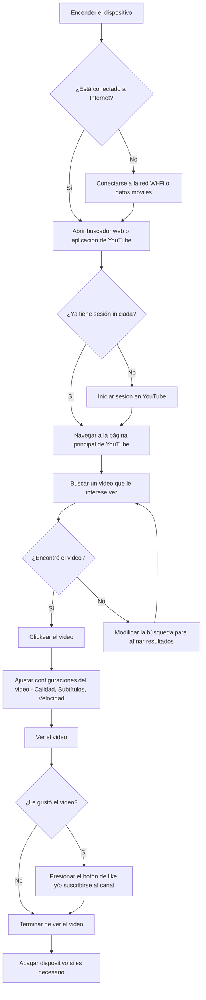

```mermaid

flowchart TD
    A[Encender el dispositivo] --> B{¿Está conectado a Internet?}
    B -->|Sí| C[Abrir buscador web o aplicación de YouTube]
    B -->|No| D[Conectarse a la red Wi-Fi o datos móviles]
    D --> C
    C --> E{¿Ya tiene sesión iniciada?}
    E -->|Sí| F[Navegar a la página principal de YouTube]
    E -->|No| G[Iniciar sesión en YouTube]
    G --> F
    F --> H[Buscar un video que le interese ver]
    H --> I{¿Encontró el video?}
    I -->|Sí| J[Clickear el video]
    I -->|No| K[Modificar la búsqueda para afinar resultados]
    K --> H
    J --> L[Ajustar configuraciones del video - Calidad, Subtítulos, Velocidad]
    L --> M[Ver el video]
    M --> N{¿Le gustó el video?}
    N -->|Sí| O[Presionar el botón de like y/o suscribirse al canal]
    N -->|No| P[Terminar de ver el video]
    O --> P
    P --> Q[Apagar dispositivo si es necesario]

```

```mermaid
flowchart TD
    A["Inicio del día - 6:00 AM"] --> B["Levantarse"]
    B --> C{"¿Se hace tarde?"}
    C -- No --> D["Acomodar la cama"]
    C -- Sí --> E["Dejar la cama desordenada"]
    D --> F["Ducha y cepillado de dientes"]
    E --> F
    F --> G["Vestirse"]
    G --> H{"¿Es jueves?"}
    
    %% Oficina o casa
    H -- Sí --> I["Alistarse para la oficina - Preparar computadora, documentos, almuerzo, etc."]
    I --> J["Salir hacia la oficina"]
    J --> K["Llegar a la oficina y prepararse para trabajar"]
    
    H -- No --> L["Quedarse en casa y encender computadora"]

    %% Rutina de trabajo
    K --> M["Revisar agenda del día"]
    L --> M
    M --> N["Desayunar mientras trabajas"]
    N --> O["Revisar correos electrónicos"]
    O --> P{"¿Posible solución para cliente?"}
    
    %% Llamadas y tareas del trabajo
    P -- Sí --> Q["Llamar a clientes con posible solución"]
    P -- No --> R["Continuar trabajando en los casos activos"]
    
    %% Progreso y pausas
    R --> S{"¿Adelantaste todo lo agendado?"}
    S -- No --> O
    S -- Sí --> T["Tomar descanso adicional"]
    
    T --> U["Hablar con compañeros o relajarse"]
    U --> V["Tomar una siesta o leer"]
    
    %% Almuerzo
    V --> W["Almorzar fuera de la oficina"]
    
    %% Fin de la jornada
    W --> X{"¿Es día de gimnasio?"}
    X -- Sí --> Y["Ir al gimnasio"]
    X -- No --> Z["Terminar día antes"]
    
    %% Cierre del día
    Y --> AA["Volver a casa y cenar"]
    Z --> AA
    AA --> AB["Relajarse o hacer actividades personales - Ver series, leer, etc."]
    
    %% Fin de la rutina
    AB --> AC{"¿Es necesario revisar correos antes de dormir?"}
    AC -- Sí --> AD["Revisar correos nuevamente"]
    AD --> AE["9:30 PM - Fin del día"]
    
    AC -- No --> AE
    AE --> AF["Apagar dispositivos y prepararse para dormir"]
    AF --> A


```
