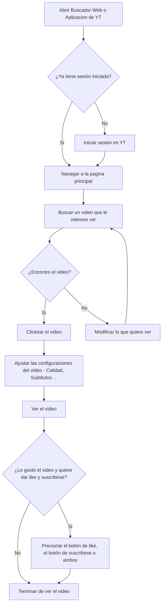

```mermaid

flowchart TD
    A[Abrir Buscador Web o Aplicacion de YT] --> B{¿Ya tiene sesión iniciada?}
    B -->|Si| C[Navegar a la pagina principal]
    B -->|No| D[Iniciar sesión en YT]
    D --> C
    C --> E[Buscar un video que le interese ver]
    E --> F{¿Encontro el video?}
    F -->|Si| G[Clickear el video]
    F -->|No| H[Modificar lo que quiere ver]
    H --> E
    G --> I[Ajustar las configuraciones del video - Calidad, Subtitulos ...]
    I --> J[Ver el video]
    J --> K{¿Le gustó el video y quiere dar like y suscribirse?}
    K -->|Si| L[Precionar el botón de like, el botón de suscribirse o ambos]
    K -->|No| M[Terminar de ver el video]
    L --> M
```
