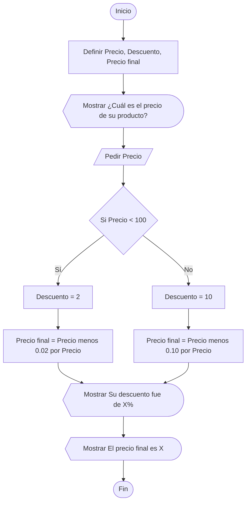
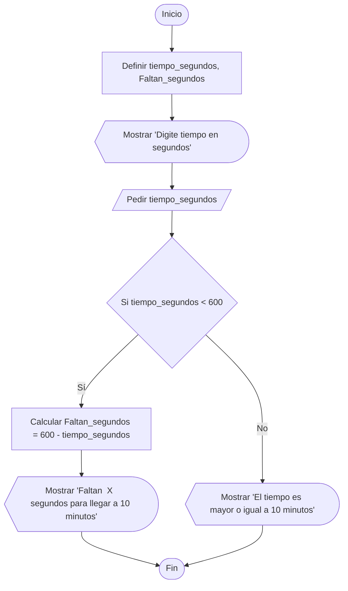
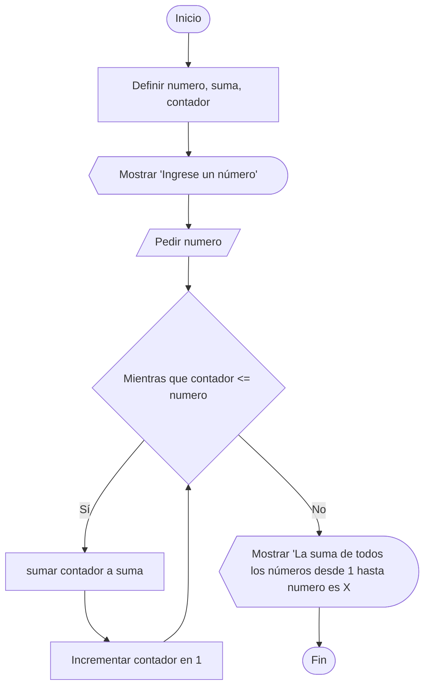
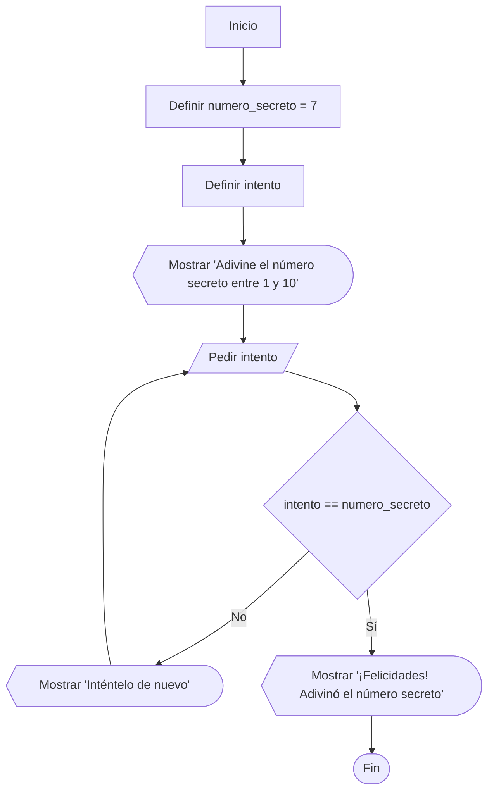
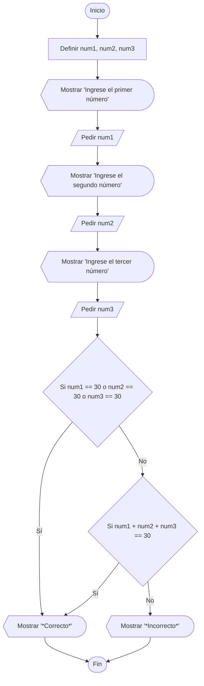

<H1>Ejercicios pseudocodigo</H1>

<h3>Ejercicio 1</h3>

```mermaid
flowchart TD
    A(["Inicio"]) --> B["Definir Precio, Descuento, Precio final"]
    B --> C["Mostrar ¿Cuál es el precio de su producto?"]
    C --> D["Pedir Precio"]
    D --> E["Si Precio &lt; 100"]
    E -- Sí --> F["Descuento = 2"]
    F --> G["Precio final = Precio menos 0.02 por Precio"]
    E -- No --> H["Descuento = 10"]
    H --> I["Precio final = Precio menos 0.10 por Precio"]
    G --> J["Mostrar Su descuento fue de X%"]
    J --> K["Mostrar El precio final es X"]
    K --> L(["Fin"])
    I --> J

    B@{ shape: rect}
    C@{ shape: display}
    D@{ shape: lean-r}
    E@{ shape: diam}
    J@{ shape: display}
    K@{ shape: display}
```
<h3>Ejercicio 2</h3>

```mermaid
flowchart TD
    A(["Inicio"]) --> B["Definir tiempo_segundos, Faltan_segundos"]
    B --> C["Mostrar 'Digite tiempo en segundos'"]
    C --> D["Pedir tiempo_segundos"]
    D --> E["Si tiempo_segundos &lt; 600"]
    E -- Sí --> F["Calcular Faltan_segundos = 600 - tiempo_segundos"]
    F --> G["Mostrar 'Faltan  X  segundos para llegar a 10 minutos'"]
    E -- No --> H["Mostrar 'El tiempo es mayor o igual a 10 minutos'"]
    G --> I(["Fin"])
    H --> I

    C@{ shape: display}
    D@{ shape: lean-r}
    E@{ shape: diam}
    G@{ shape: display}
    H@{ shape: display}
```
<h3>Ejercicio 3</h3>

```mermaid
flowchart TD
    A(["Inicio"]) --> B["Definir numero, suma, contador"]
    B --> C["Mostrar 'Ingrese un número'"]
    C --> D["Pedir numero"]
    D --> E["Mientras que contador &lt;= numero"]
    E -- Sí --> F["sumar contador a suma"]
    F --> G["Incrementar contador en 1"]
    G --> E
    E -- No --> H["Mostrar 'La suma de todos los números desde 1 hasta numero es X"]
    H --> I(["Fin"])

    C@{ shape: display}
    D@{ shape: lean-r}
    E@{ shape: diam}
    H@{ shape: display}
```

<h1>Numero secreto</h1>

```mermaid
flowchart TD
    A["Inicio"] --> B["Definir numero_secreto = 7"]
    B --> C["Definir intento"]
    C --> D["Mostrar 'Adivine el número secreto entre 1 y 10'"]
    D --> E["Pedir intento"]
    E --> F["intento == numero_secreto"]
    F -- No --> G["Mostrar 'Inténtelo de nuevo'"]
    G --> E
    F -- Sí --> H["Mostrar '¡Felicidades! Adivinó el número secreto'"]
    H --> I(["Fin"])

    D@{ shape: display}
    E@{ shape: lean-r}
    F@{ shape: diam}
    G@{ shape: display}
    H@{ shape: display}

```
<h1>Valor 30?</h1>

```mermaid
flowchart TD
    A(["Inicio"]) --> B["Definir num1, num2, num3"]
    B --> C["Mostrar 'Ingrese el primer número'"]
    C --> D["Pedir num1"]
    D --> E["Mostrar 'Ingrese el segundo número'"]
    E --> F["Pedir num2"]
    F --> G["Mostrar 'Ingrese el tercer número'"]
    G --> H["Pedir num3"]
    H --> I["Si num1 == 30 o num2 == 30 o num3 == 30"]
    I -- Sí --> J["Mostrar '*Correcto*'"]
    I -- No --> K["Si num1 + num2 + num3 == 30"]
    K -- Sí --> J
    K -- No --> L["Mostrar '*Incorrecto*'"]
    J --> M(["Fin"])
    L --> M

    C@{ shape: display}
    D@{ shape: lean-r}
    E@{ shape: display}
    F@{ shape: lean-r}
    G@{ shape: display}
    H@{ shape: lean-r}
    I@{ shape: diam}
    J@{ shape: display}
    K@{ shape: diam}
    L@{ shape: display}
```
